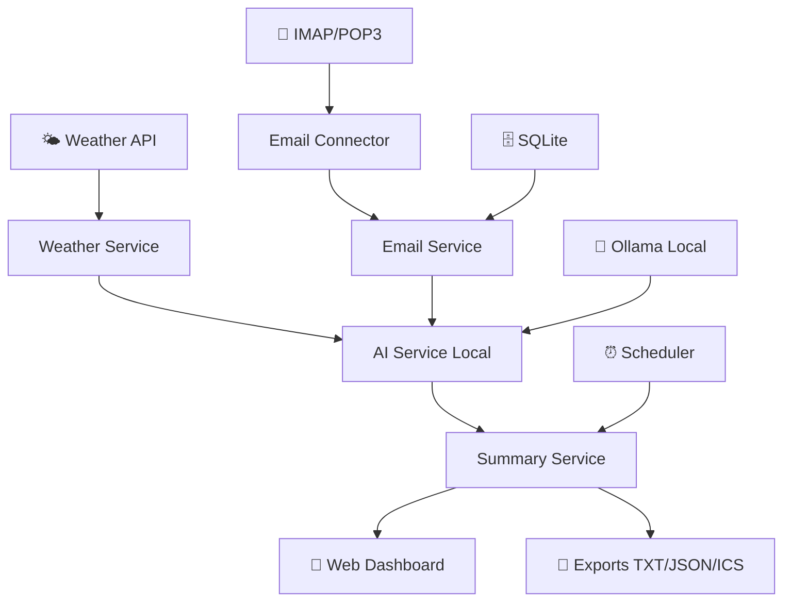

# 📧🌤️ SynthMail - Email & Weather AI Assistant

> **Assistant IA intelligent pour résumé quotidien automatique des emails non lus avec prévisions météo intégrées**  
> *Entièrement conçu et développé par Intelligence Artificielle*

[](https://python.org)
[](https://fastapi.tiangolo.com)
[](https://docker.com)
[](LICENSE)
[](https://ollama.ai)

## 🎯 Vue d'ensemble

L'**Email & Weather AI Assistant** génère automatiquement chaque matin à 7h00 un résumé intelligent de vos emails non lus, classés par priorité, avec détection automatique des rendez-vous et prévisions météo sur 3 jours.

### ✨ Fonctionnalités principales

- 🤖 **IA locale** avec Ollama (confidentialité absolue)
- 📧 **Analyse intelligente** emails avec classification priorité
- 📅 **Détection automatique** rendez-vous + export .ics
- 🌦️ **Prévisions météo** 3 jours intégrées
- ⏰ **Génération automatique** quotidienne 7h00
- 🎨 **Dashboard web** responsive et intuitive
- 🔐 **Confidentialité maximale** - aucune donnée ne quitte votre machine
- 🐳 **Déploiement Docker** simple en une commande

## 🏗️ Architecture



## 🚀 Installation Rapide

### Prérequis

- **Docker** & **Docker Compose**
- **8GB RAM** minimum (pour modèles IA)
- **Python 3.11+** (optionnel, pour développement)

### 🐳 Déploiement Production (Docker)

```bash
# 1. Cloner le repository
git clone https://github.com/chonchachon/synthmail.git
cd synthmail

# 2. Configuration
cp .env.example .env
# Éditer .env avec vos paramètres email et météo

# 3. Démarrage complet
./scripts/install.sh

# 4. Accès interface web
open http://localhost:8080
```

### ⚙️ Configuration Manuelle

```bash
# Configuration variables d'environnement
EMAIL_PROVIDER=gmail                    # gmail/outlook/yahoo/custom
EMAIL_USERNAME=votre.email@gmail.com
EMAIL_PASSWORD=ENCRYPTED:your_app_password
WEATHER_API_KEY=your_openweather_key
WEATHER_LOCATION="Paris,FR"
GENERATION_TIME="07:00"
```

## 📖 Guide d'Utilisation

### Configuration Email

1. **Gmail/Outlook** : Utiliser un "mot de passe d'application"
2. **Autres providers** : Configuration IMAP/POP3 personnalisée
3. **Sécurité** : Tous les credentials sont chiffrés AES-256

### Interface Web

- **Dashboard principal** : `http://localhost:8080`
- **Génération manuelle** : Bouton "Générer maintenant"
- **Configuration** : `http://localhost:8080/config`
- **API Documentation** : `http://localhost:8080/docs`

### Exports Automatiques

- 📄 **Résumé texte** : `/data/summaries/YYYY-MM-DD.txt`
- 🗂️ **Données JSON** : `/data/summaries/YYYY-MM-DD.json`
- 📅 **Calendrier ICS** : `/data/exports/appointments.ics`

## 🛠️ Développement

### Setup Développement

```bash
# Environment virtuel Python
python -m venv venv
source venv/bin/activate  # Linux/Mac
# venv\Scripts\activate   # Windows

# Installation dépendances
pip install -r requirements.txt
pip install -r requirements-dev.txt

# Setup base de données
python -m src.config.database --init

# Tests
pytest tests/ -v --cov=src
```

### Structure Projet

```
synthmail/
├── 🐳 docker-compose.yml       # Orchestration services
├── 📦 src/                     # Code source application
│   ├── api/                    # API REST FastAPI
│   ├── config/                 # Configuration & DB
│   ├── connectors/             # IMAP, Ollama, Weather
│   ├── models/                 # Modèles SQLAlchemy
│   ├── services/               # Logique métier
│   ├── utils/                  # Utilitaires crypto/dates
│   └── web/                    # Interface web
├── 🧪 tests/                   # Tests unitaires/intégration
├── 📊 data/                    # Données & prompts IA
├── 🔧 scripts/                 # Scripts installation/maintenance
└── 📚 docs/                    # Documentation
```

## 🔐 Sécurité & Confidentialité

### Principes

- ✅ **Zéro fuite de données** - Traitement 100% local
- ✅ **Chiffrement AES-256** des credentials
- ✅ **Mots de passe d'application** (pas de mot de passe principal)
- ✅ **IA locale Ollama** (pas de cloud)
- ✅ **Logs sécurisés** sans données sensibles

### Modèles IA Supportés

| Modèle | Taille | RAM Requis | Qualité |
|--------|--------|------------|---------|
| **Llama 3.1 8B** | 4.7GB | 8GB | ⭐⭐⭐⭐⭐ |
| **Mistral 7B** | 4.1GB | 6GB | ⭐⭐⭐⭐ |
| **Phi-3 Mini** | 2.3GB | 4GB | ⭐⭐⭐ |

## 📊 API Documentation

### Endpoints Principaux

```http
GET  /health                    # Statut système
GET  /api/summary/latest        # Dernier résumé
POST /api/summary/generate      # Génération manuelle
GET  /api/config                # Configuration actuelle
POST /api/config/test-email     # Test connexion email
GET  /api/files/ics/{date}      # Export calendrier
```

### Exemple Réponse API

```json
{
  "summary": {
    "date": "2025-06-19",
    "email_count": 15,
    "urgent": 2,
    "important": 5,
    "weather": {
      "location": "Paris",
      "temperature": 22,
      "condition": "Ensoleillé"
    },
    "appointments": [
      {
        "title": "Réunion équipe",
        "date": "2025-06-20",
        "time": "14:00"
      }
    ]
  }
}
```

## 🔧 Maintenance

### Scripts Utilitaires

```bash
# Sauvegarde complète
./scripts/backup.sh

# Mise à jour application
./scripts/update.sh

# Setup nouveau modèle IA
./scripts/setup-ollama.sh llama3.1

# Logs système
./scripts/logs.sh --follow
```

### Monitoring

- **Health check** : `curl http://localhost:8080/health`
- **Logs application** : `./data/logs/app.log`
- **Logs Ollama** : `docker logs ollama -f`
- **Métriques** : Interface Grafana (optionnel)

## 🐛 Troubleshooting

### Problèmes Courants

| Problème | Solution |
|----------|----------|
| **Connexion email échoue** | Vérifier mot de passe d'application |
| **IA ne répond pas** | Redémarrer Ollama : `docker restart ollama` |
| **Génération lente** | Réduire modèle IA ou augmenter RAM |
| **Météo indisponible** | Vérifier clé API OpenWeatherMap |

### Debug Mode

```bash
# Activation logs détaillés
export LOG_LEVEL=DEBUG
export ENVIRONMENT=development

# Test connexions
python -m src.connectors.email_connector --test
python -m src.connectors.weather_connector --test
```

## 🤝 Contribution

1. **Fork** le projet
2. **Créer** une branche feature (`git checkout -b feature/amelioration`)
3. **Commit** vos changements (`git commit -m 'Ajout nouvelle fonctionnalité'`)
4. **Push** vers la branche (`git push origin feature/amelioration`)
5. **Ouvrir** une Pull Request

### Standards Code

- **Black** formatage automatique
- **Pylint** qualité code
- **Tests** coverage >80%
- **Type hints** obligatoires
- **Documentation** docstrings

## 📋 Roadmap

### Version 1.1 (Q3 2025)
- [ ] 📱 **Application mobile** companion
- [ ] 🔔 **Notifications** Slack/SMS
- [ ] 📈 **Analytics** personnels
- [ ] 🎤 **Commandes vocales**

### Version 1.2 (Q4 2025)
- [ ] 🤖 **Actions automatiques** (réponses, tâches)
- [ ] 🔗 **Intégrations** (Trello, Notion, etc.)
- [ ] 🌍 **Multi-langues** interface
- [ ] ☁️ **Option cloud** (keeping local default)

## 🏆 Remerciements

- **Ollama** pour l'IA locale fantastique
- **FastAPI** pour l'API moderne et rapide
- **OpenWeatherMap** pour les données météo
- **Community** pour les retours et contributions

> 🤖 **Note spéciale** : Ce projet a été entièrement conçu, architecturé et développé par Intelligence Artificielle (Claude), démontrant les capacités créatives et techniques de l'IA moderne dans la création d'applications complexes.

## 📄 License

Ce projet est sous licence **GNU General Public License v3.0**. Voir le fichier [LICENSE](LICENSE) pour plus de détails.

Cette licence garantit :
- ✅ **Utilisation libre** pour usage personnel et commercial
- ✅ **Modification autorisée** avec partage obligatoire des améliorations
- ✅ **Distribution libre** en conservant la même licence
- ✅ **Protection utilisateurs** contre les brevets

---

<div align="center">

**Développé avec ❤️ pour l'efficacité quotidienne et la confidentialité**

[🌟 Star ce projet](https://github.com/chonchachon/synthmail) • [🐛 Signaler un bug](https://github.com/chonchachon/synthmail/issues) • [💡 Proposer une fonctionnalité](https://github.com/chonchachon/synthmail/issues/new)

</div>
